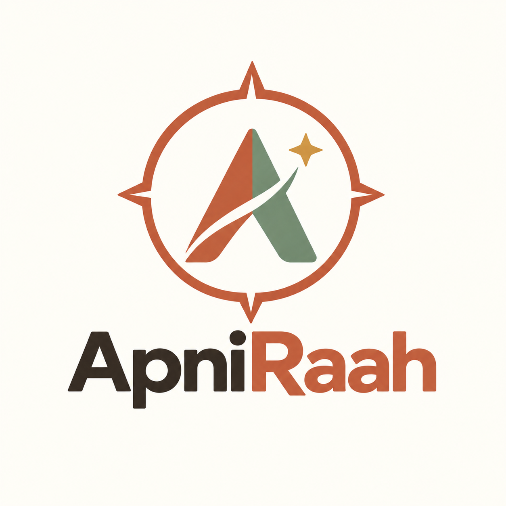

<div align="center">
  

  # Intelligent Skill Mapping & Employability System

  **Analyze. Adapt. Advance.**

  *Know your skills · Discover your gaps · Build your career*
</div>

---

## The problem we set out to solve

Ask a final-year student what they want to do, and you will usually get one of two answers. Either "I don't know yet," or a confident role name followed by silence when you ask what they still need to learn.

Neither student is lazy. Both are drowning in resources — free courses, YouTube playlists, roadmaps on Twitter, advice from seniors. What they actually lack is something much simpler: **an honest picture of where they stand right now, and a clear idea of what to do next week.**

ApniRaah was built for exactly that gap. It does not hand out another course list. It looks at what a student genuinely knows, measures it against what a real role demands, and turns the difference into a plan they can start on tomorrow.

---

## What it does

### It meets students where they are

Two students open the app with completely different needs, so ApniRaah asks one question at the start and then splits the path.

A student who has no idea what to pursue goes through a short **career discovery** flow — a few questions about interests, strengths and how they like to work — and comes out with matching career paths, each explained in plain language. No personality-quiz theatrics, no jargon.

A student who already knows their direction skips all of that. If they know the exact role, they pick it and tell us whether they want to **grow in it** or **switch out of it**. If they only know the broad domain, we help them narrow it down to something concrete. And if they already have a career in mind, they can simply type it in and let the engine work out the rest.

### It takes proficiency seriously

Most skill trackers treat skills as checkboxes. But "I know React" means something very different coming from a student who has built three projects versus one who finished a tutorial last weekend.

So every skill is captured at a **level** — Beginner, Intermediate or Advanced — and the entire analysis is built on that distinction.

### It tells the truth about gaps

Each skill a role requires is placed into one of three buckets:

- **Matched** — the student's level meets or exceeds what the role needs
- **Needs Improvement** — the skill is there, but not deep enough yet
- **Missing** — not present at all

Every gap also carries a **priority**, and here is the part that makes the analysis honest: the depth required scales with that priority. A high-priority skill has to reach Advanced to count as matched. A low-priority one only needs Beginner. A student cannot coast to a good score by collecting shallow knowledge across many skills.

All of this rolls up into a single **readiness score** — matched skills count fully, partial skills count half. It is designed to be accurate rather than flattering, because a comfortable number that lies to a student helps nobody.

### It builds a plan that fits the student's actual life

The roadmap is not a generic curriculum. It is generated from four inputs: the target role, the student's current levels, the priority of each gap, and — crucially — **how much time they can realistically study each day.**

Skills are ordered by dependency, so nothing is scheduled before its prerequisites. Each one carries an hour estimate, and those hours convert into real weeks based on the student's available time. A student with thirty minutes a day and one with three hours get genuinely different timelines for the same goal.

Before the roadmap, a **Reality Check** screen lays out the blockers and critical gaps plainly. Expectations get set before the effort starts.

### It gives them somewhere to actually practise

Reading about CSS is not learning CSS. The **Grind Zone** contains fullscreen hands-on labs — CSS, JavaScript, project building, a certificate builder — so progress comes from doing, not just from marking things complete.

Progress tracking then closes the loop: roadmap steps completed, weekly activity, and a visual view that keeps momentum measurable.

### It works in the student's language

The entire interface is available in **English and हिन्दी**, with a language switcher that lists every major Indian language and marks the rest as coming soon.

This was not an afterthought. The students who most need career guidance are often the ones least served by English-only tools, and building the translation layer in from the start meant we never had to retrofit it.

---

## How a student moves through it

```
                    ┌─→  Absolute Beginner  ─→  Career Discovery  ─┐
   Gateway  ────────┤                                              ├─→  Skill Assessment
                    └─→  I Know My Role     ─→  Role / Domain     ─┘            │
                                                                                ↓
        Progress  ←──  Grind Zone  ←──  Roadmap  ←──  Reality Check  ←──  Gap Analysis
```

The Gateway is always the first screen. Returning users reach their dashboard by signing in.

---

## Technology

The frontend is built with **React 19** on **Vite 8**, styled with **Tailwind CSS v4** using a fully token-driven design system, animated with **Framer Motion**, and routed with **React Router v7**. State lives in two React contexts — one for language, one for the user's profile — which keeps the data flow easy to follow without pulling in a state-management library.

The analysis and roadmap logic sits in `SkillMap/client/src/utils/roadmap.js` as plain, testable functions. Skill classification, readiness weighting, hour estimation and dependency ordering are all there, independent of any component.

The backend is **Node.js** with **Express 5** and **MongoDB** via Mongoose, with resume parsing handled by Multer and pdf-parse.

> **A note on the current state:** authentication is presently mocked on the frontend using localStorage, which lets the entire application run end to end without a backend or database. The server-side auth routes are written and intact in `src/routes/auth.routes.js`; they simply are not mounted in `src/app.js` yet. Re-enabling them is a two-line change.

---

## Project structure

```
ApniRaah/
├── server.js, src/, routes/, controllers/, data/    Root backend — analysis & resume APIs
├── render.yaml                                      Deployment configuration
└── SkillMap/
    ├── client/                                      React frontend
    │   └── src/
    │       ├── pages/         Gateway, Counselling, Landing, Dashboard, Analysis,
    │       │                  Reality, Roadmap, Learning, Progress, Profile
    │       ├── components/    layout · common · analysis · onboarding
    │       │                  roadmap · reality · tracker · warzone (labs)
    │       ├── utils/         data.js (roles & skills) · roadmap.js (engine) · i18n
    │       ├── context/       LanguageContext · ProfileContext
    │       └── services/      API layer & mock authentication
    ├── server/                Roadmap, progress and task services
    └── MainUI/                Static landing page
```

---

## Running it locally

You will need Node.js 18 or newer. MongoDB is only required if you intend to run the backend — the frontend works completely on its own.

**Frontend**

```bash
cd SkillMap/client
npm install
npm run dev
```

The app will be available at `http://localhost:5173`.

**Backend** *(optional)*

```bash
npm install
npm run dev
```

Create a `.env` file in the project root:

```
PORT=5000
MONGO_URI=your_mongodb_connection_string
```

**Available scripts**

Inside `SkillMap/client`, `npm run dev` starts the development server, `npm run build` produces a production build in `dist/`, `npm run preview` serves that build locally, and `npm run lint` runs ESLint. At the project root, `npm run dev` starts the backend with nodemon and `npm start` runs it directly.

---

## Deployment

The frontend is a static build and can be deployed anywhere that serves static files. On Vercel or Netlify, set the **root directory to `SkillMap/client`**, use `npm run build` as the build command and `dist` as the output directory. A `render.yaml` is included for Render's blueprint deployments.

Since the app uses client-side routing, the host needs to fall back to `index.html` for unknown paths. `vercel.json` and `public/_redirects` are both included so this works out of the box on either platform.

---

## Design

The interface uses a warm, deliberately un-corporate palette — terracotta, sage and warm gold on a cream background. The goal was something that feels approachable to an eighteen-year-old rather than intimidating, while still looking credible enough to be taken seriously.

| Role | Value |
|---|---|
| Background | `#F7F2E9` |
| Surface | `#FFFDF9` |
| Primary — Terracotta | `#C86B4A` |
| Primary Dark | `#A9543B` |
| Sage | `#789178` |
| Warm Gold | `#D2A34A` |
| Text | `#292722` |
| Secondary Text | `#756F66` |
| Border | `#E7DED2` |

Every one of these lives as a design token in `SkillMap/client/src/index.css`, which means the entire product can be re-themed from a single file. The layout is fully responsive across mobile, tablet and desktop.

---

## The team

**Noida Institute of Engineering and Technology** — College Code 133

| Name | Role | Roll No. |
|---|---|---|
| **Aditya Upadhyay** | Team Leader | 2501330100038 |
| **Ananya Singh** | Team Member | 2501330100068 |

Built for the **IndiaAI — Education & Skilling** track.

<div align="center">

---

*Same potential. More possibilities.*

**From learning to earning.**

</div>
